# SGE_B_GRUPD

### Els integrants del nostre grup som:
* Álvaro Huamani (D)
* Yoon López (A)
* Carlos Pérez (C)

# Introducció al projecte
Una forma molt prà

# Empleats
En obrir el mòdul de "Empleats", el primer que apareix és una pantalla inicial on només apareix l'**usuari de l'administrador/creador de la pàgina**

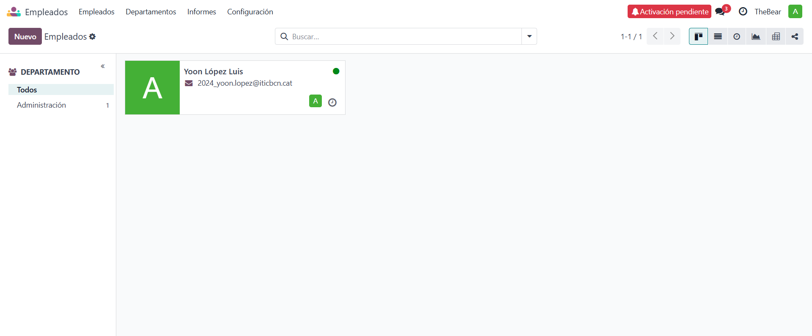 *001. Pantalla inicial del mòdul d'empleats*

Des d'aquí, podem **importar registres** d'altres mòduls d'empleats que hem pogut crear prèviament, pel que modificar i escalar el sistema és molt senzill i pràctic.

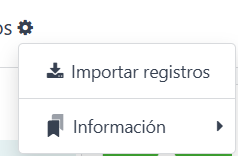 *002. Importar registres*

## Crear empleats

**Crear nous empleats** és molt senzill. Només li hem de donar a "Nuevo" i apareix una pantalla on s'han d'omplir els camps que necessitem per indicar la informació del treballador.

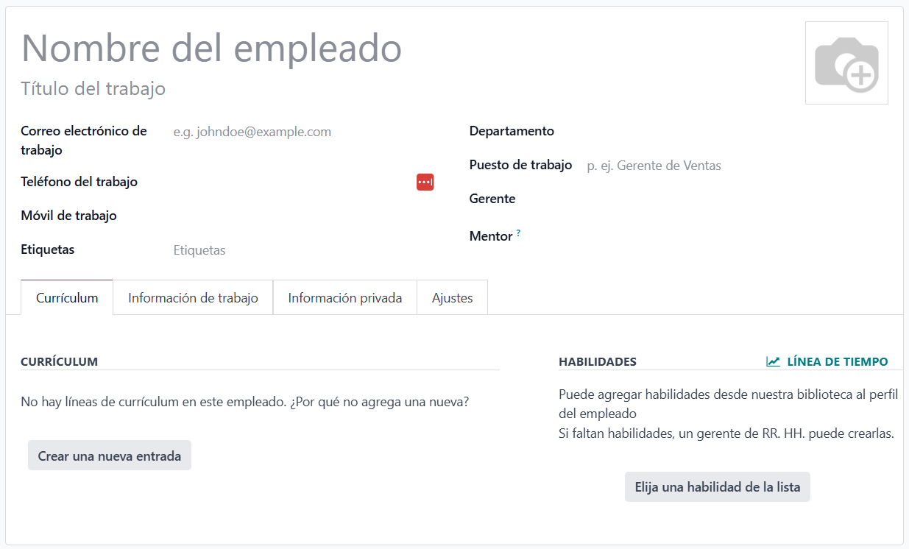 *003. Crear nou empleat*

### Dades bàsiques

Per **introduïr les dades**, només hem de fer clic sobre el camp corresponent i escriure a sobre.

Hi han algunes dades que tenen valors que cal registrar, com les etiquetes, el departament o el gerent i el mentor. En aquests casos, només li hem de donar a "Crear y editar" per crear de nous, o seleccionar que ja existeix.

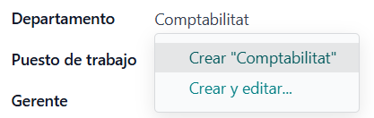 *004. Crear departament*

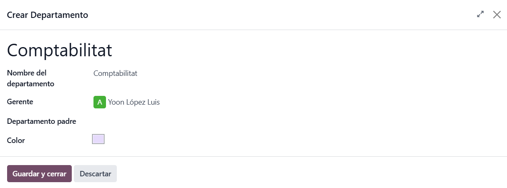 *005. Editar departament*

Un cop editat un departament, es posan el gerent i el mentor automàticament segons hem indicat. En el cas de les etiquetes, el color que es posarà també és automàtic.

També hem de tenir en compte que, el que posem al cap de lloc de treball, es posarà automàticament a "Títol de treball", tot i que ho podem editar després de posar-ho.

### Currículum

A l'apartat de **currículum**, podem introduïr l'experiència i les habilitats del treballador.

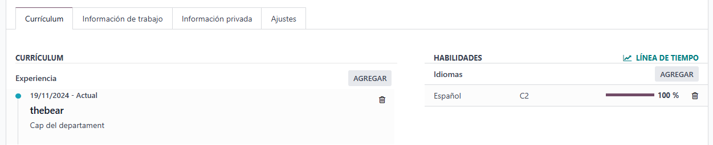 *006. Exemple de currículum*

Hi ha dos tipus d'habilitats: idiomes i habilitats blandes. En qualsevol dels casos s'ha d'indicar el nivell d'aquesta.

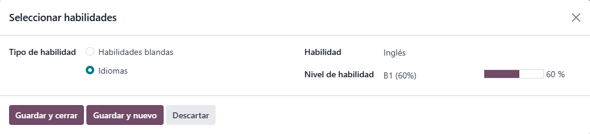 *007. Addició d'habilitats*

### Informació de treball

A aquest apartat, surt la **informació del lloc de treball**: ubicació, horari, planificació i organigrama. En el cas de l'organigrama, no sortirà si no hem indicat que tingui superiors o subordinats.

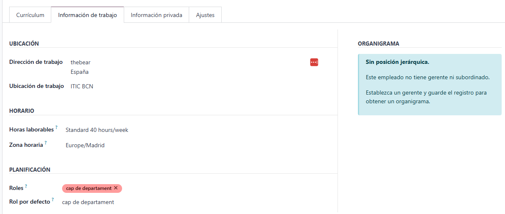 *008. Exemple sense organigrama*

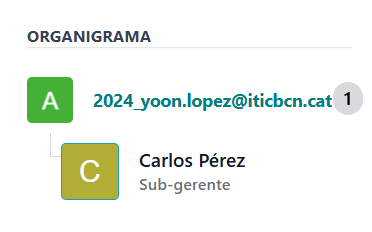 *009. Exemple d'organigrama*

### Informació privada

A l'apartata d'**informació privada**, trobem les dades de contacte, documentació, contactes d'emergència, educació i, en cas d'estrangers, informació del permís de treball.

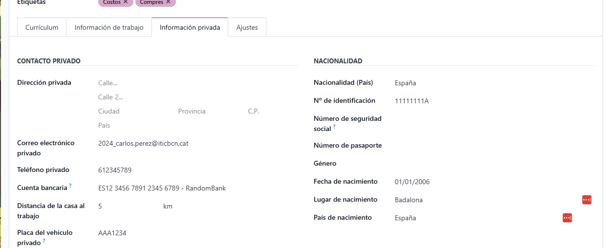
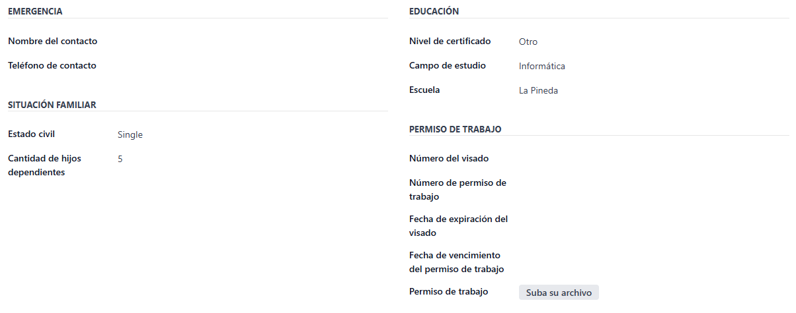
*010. Exemple de informació privada*

### Perfil complet

Així doncs, un exemple de perfil completat seria el següent:

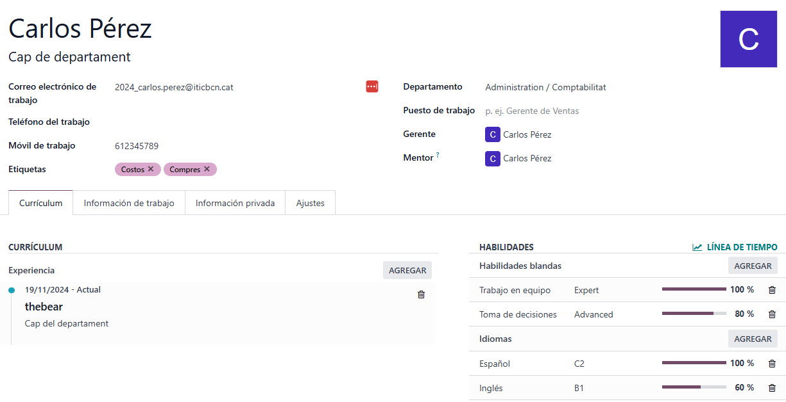 *011. Exemple de perfil complet*

## Apartat departaments

A l'apartat "Departamentos", podem veure la informació dels empleats creats distribuits per departaments.

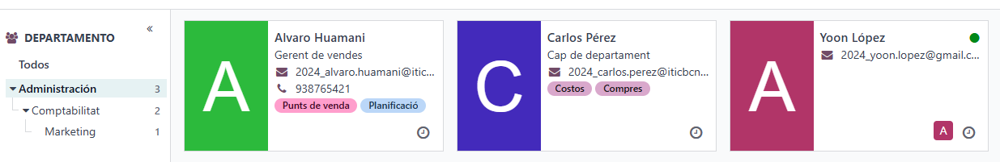 *012. Exemple en el que es veuen tots els empleats del departament "Administració" i tots els departaments que penjen d'ell.*

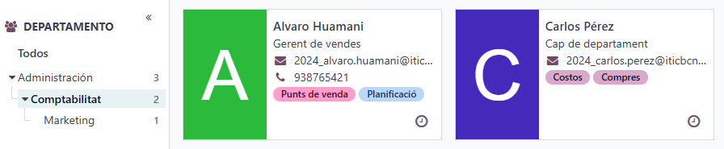 *013. Exemple en el que es veuen els empleats de "Comptabilitat. En aquest cas, no es veu l'empleat d'Administració, perquè està per sobre"*

## Apartat informes

A l'apartat "Informes", es veuen les habilitats de cada treballador.

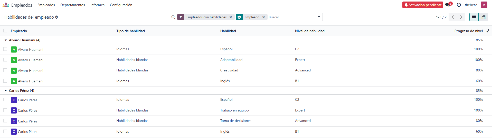 *014. Visió de l'apartat informes*

## Configuració

Al desplegable de configuració, podem veure diferents configuracions que podem aplicar, segons la seva temàtica.

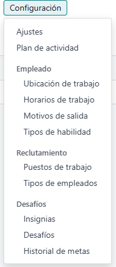 *015. Configuració del mòdul*

- **Ajustes**: configuració general de la pàgina
- **Plan de actividad**: com es reparteixen les tasques
- **Empleado**: Informació sobre els treballadors
- **Reclutamiento**: llocs disponibles i empleats que es necessiten
- **Desafíos**: reptes que incentiven l'esforç

# Compres

# Punts de venda

# Events

En obrir per primer cop el mòdul d'events, surt buit.

En aquest cas, també podem importar registres, per si s'ha de fer algun manteniment o migració.

 *. Primer contacte amb el mòdul d'events*

## Crear events

Per **crear events**, l'únic que hem de fer és omplir els camps que siguin necessaris, igual que en els mòduls anteriors.

 *. Creació d'events*

A la part superior dreta, podem seleccionar l'estat en el que es troba l'event. Això és interessant per la forma en la que es veuran despres les llistes dels events.

## Entrades

Aquí podem configurar les entrades de cada tipus que hi ha.

En aquest exemple, només hi ha una, però podem afegir més.

 *. Apartat d'entrades*

# Costos

# Planificació